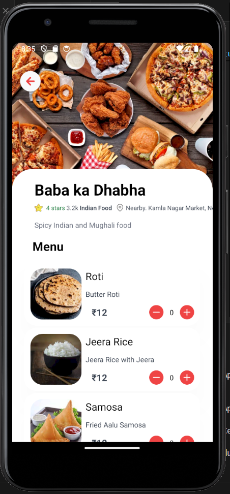

# HungryHippo

## Overview
HungryHippo is a food delivery app developed using React Native. It allows users to browse through different restaurants, add items to their cart, calculate the total bill, and view the location of the selected restaurant on a map. The app utilizes various libraries and tools such as NativeWind for styling, React Native Maps for map functionality, Expo for development, Redux for state management, React Native Feather Icons for icons, and React Navigation for navigation.

## Functionality
- Browse through different restaurants
- View restaurant details and menu items
- Add or remove items from the cart
- Calculate the total bill
- View the location of the selected restaurant on a map
- Navigate between different screens using React Navigation

## Technologies Used
- React Native: Core framework for building the mobile app
- NativeWind: Utility-first CSS framework for styling
- React Native Maps: Library for displaying maps and location data
- Expo: Development toolchain and platform for building React Native apps
- Redux: State management library for managing app state
- React Native Feather Icons: Icon library for UI components
- React Navigation: Library for navigation in React Native apps

## Learnings
Through the development of HungryHippo, I gained valuable experience in:
- Building a complete mobile app frontend with React Native
- Integrating third-party libraries and tools for enhanced functionality
- Managing app state effectively using Redux
- Implementing navigation and routing using React Navigation
- Utilizing map functionality in React Native apps with React Native Maps

## Preview

## Author
This app is developed by Vishal Pandey.
